# 최종 프로젝트: Criteo 광고 어트리뷰션 iceberg-Lakehouse

이 프로젝트는 `criteo/criteo-attribution-dataset`을 Kafka로 재생해 실시간 광고 이벤트처럼 만들고, 로컬 Kubernetes 위에서 Kafka, Spark Streaming, Airflow, Trino, Superset을 운영하는 광고 어트리뷰션 Lakehouse 예제입니다. 저장소와 메타데이터는 로컬이 아니라 AWS S3 + Glue Catalog + Apache Iceberg를 사용합니다.

핵심 설계 원칙은 다음입니다.

- Bronze는 원천 복구를 위한 append-only raw S3 zone으로 둔다.
- Silver와 Gold는 Iceberg 테이블로 관리해 MERGE, snapshot, metadata table, compaction, rollback/backfill을 활용한다.
- 로컬 Kubernetes에서도 실행되지만, Spark 코드는 EMR on EKS로 옮길 때 거의 그대로 쓴다.
- Airflow는 단순 cron이 아니라 스트리밍 시작/재시작, 배치, maintenance, health check, backfill을 관리하는 운영 제어면이다.

참고한 공식/원천 문서:

- 데이터셋: [Hugging Face criteo/criteo-attribution-dataset](https://huggingface.co/datasets/criteo/criteo-attribution-dataset)
- Iceberg AWS Glue Catalog: [Apache Iceberg AWS docs](https://iceberg.apache.org/docs/latest/docs/aws/)
- Iceberg Spark procedures: [Apache Iceberg Spark procedures](https://iceberg.apache.org/docs/latest/spark-procedures/)
- Spark dynamic allocation: [Spark 3.5 job scheduling docs](https://spark.apache.org/docs/3.5.5/job-scheduling.html)
- Iceberg Spark runtime artifact: [Maven Central iceberg-spark-runtime-3.5_2.12](https://repo.maven.apache.org/maven2/org/apache/iceberg/iceberg-spark-runtime-3.5_2.12/)

## 1. 도메인 정의 + 핵심 KPI 3개

도메인은 광고 어트리뷰션입니다. 광고 클릭 이벤트가 들어오고, 일정 시간 뒤 구매 전환이 발생했는지, 그 전환이 Criteo 광고 성과로 인정되었는지를 분석합니다.

데이터셋 주요 컬럼:

| 컬럼 | 의미 | 설계상 사용 |
|---|---|---|
| `timestamp` | 원천 이벤트 시각, 초 단위 | producer에서 현재 시간 기준 `event_time`으로 재생 |
| `uid` | 사용자 ID | Silver의 `user_id` |
| `campaign` | 캠페인 ID | Gold 집계 차원 |
| `conversion` | 실제 구매 전환 여부 | conversion rate 계산 |
| `attribution` | Criteo 성과 인정 여부 | attributed conversion 계산 |
| `click` | 클릭 여부 | click count |
| `cost` | 광고 비용 | spend, CPA 계산 |
| `click_pos`, `click_nb` | 사용자 클릭 경로 내 위치/총 클릭 수 | 품질 분석과 향후 feature engineering |
| `cat1`~`cat9` | 익명화된 문맥 feature | 향후 모델/세그먼트 확장 지점 |

핵심 KPI 3개:

1. Attributed Conversions: 광고 성과로 인정된 전환 수
2. Spend: 캠페인별 광고 비용 합계
3. Cost per Attributed Conversion: `spend / attributed_conversions`

보조 KPI:

- Clicks
- Conversion Rate: `conversions / clicks`
- 캠페인별 시간대 성과
- 고비용 저전환 캠페인 탐지

## 2. 전체 아키텍처

```mermaid
flowchart LR
    HF["Hugging Face Dataset\ncriteo_attribution_dataset.tsv.gz"] --> Producer["Kafka Producer\nreplay as real-time events"]
    Producer --> Kafka["Kafka\ncriteo-attribution-events"]

    Kafka --> BronzeStream["Spark Structured Streaming\nKafka to Bronze"]
    BronzeStream --> Bronze["S3 Bronze raw zone\nappend-only Parquet\npayload + Kafka metadata"]

    Bronze --> SilverStream["Spark Structured Streaming\nBronze to Silver"]
    SilverStream --> Silver["Iceberg Silver\nGlue Catalog + S3\nMERGE by event_id"]

    Silver --> GoldBatch["Spark Batch\nSilver to Gold"]
    GoldBatch --> Gold["Iceberg Gold\ncampaign hourly/daily KPI"]

    Silver --> Maintenance["Airflow scheduled\nCompaction / Expire / Orphan cleanup"]
    Gold --> Maintenance

    Silver --> Health["Health Check SQL\nIceberg metadata tables"]
    Gold --> Health
    Health --> Ops["Iceberg Ops tables\nhealth_check_results\nstreaming_batch_metrics"]

    Gold --> Trino["Trino Iceberg connector\nGlue Catalog"]
    Ops --> Trino
    Trino --> Superset["Superset Dashboard\nBusiness + Operations tabs"]

    Airflow["Airflow on Kubernetes"] --> BronzeStream
    Airflow --> SilverStream
    Airflow --> GoldBatch
    Airflow --> Maintenance
    Airflow --> Health
```



실행 환경:

- Local Kubernetes: `kind` 또는 기존 로컬 K8s
- Workflow: Airflow
- Streaming/Batches: Spark on Kubernetes via Spark Operator
- Queue: Kafka single-node KRaft for local
- Storage: AWS S3 bucket `metacode-iceberg-lakehouse`
- Catalog: AWS Glue Catalog
- Table format: Apache Iceberg for Silver/Gold/Ops
- Query engine: Trino
- BI: Superset

## 3. 메달리온 3계층 의사결정

### 3-1. Bronze: raw S3 zone

Bronze는 Iceberg 테이블로 만들지 않고 S3 raw path에 append-only Parquet로 저장합니다.

위치:

```text
s3://metacode-iceberg-lakehouse/bronze/criteo_attribution_events/
```

저장 필드:

- Kafka topic, partition, offset
- Kafka timestamp
- raw JSON payload
- payload hash
- bronze ingest timestamp
- ingest date/hour partition

이 결정을 한 이유:

- Bronze의 1차 목적은 분석이 아니라 복구와 재처리입니다.
- 원천 payload를 그대로 보존해야 3개월 뒤 정제 로직 버그가 발견되어도 다시 Silver를 만들 수 있습니다.
- Kafka offset과 payload hash를 남기면 중복 원인 분석이 가능합니다.
- 과제 요구사항의 Iceberg 활용은 Silver/Gold/Ops에서 충분히 드러나고, Bronze raw 보존은 실무적으로 더 안전합니다.

평가자가 Bronze를 Glue에서 조회하고 싶어 할 수 있으므로 `code/ddl/athena/bronze_external_table.sql`에 optional external table DDL을 제공합니다. 단, 이 테이블은 Iceberg가 아니라 raw inspection 용도입니다.

### 3-2. Silver: processed Iceberg table

테이블:

```text
lakehouse.ad_attribution_silver.events
```

역할:

- JSON payload parsing
- 타입 변환
- event time 생성
- `uid` -> `user_id`, `campaign` -> `campaign_id`
- event_id 기준 중복 제거
- Kafka metadata 보존
- MERGE 기반 멱등 upsert

파티션:

```sql
PARTITIONED BY (days(event_time), bucket(64, campaign_id))
```

광고 도메인에서 이 파티션이 맞는 이유:

- 대시보드와 백필은 대부분 날짜 범위로 들어옵니다.
- 캠페인별 집계가 핵심이므로 campaign bucket으로 파일 분산을 유도합니다.
- 일 100만 이벤트에서는 과하지만, 10x/100x 성장 시 campaign skew를 완화할 준비가 됩니다.

### 3-3. Gold: summary Iceberg tables

테이블:

```text
lakehouse.ad_attribution_gold.campaign_hourly_kpis
lakehouse.ad_attribution_gold.campaign_daily_kpis
```

집계 grain:

- hourly: `event_date`, `event_hour`, `campaign_id`
- daily: `event_date`, `campaign_id`

Gold는 BI와 운영자가 보는 안정된 serving layer입니다. Backfill 이후 Gold 재집계를 별도 Airflow task로 둔 이유는, Silver 수정과 대시보드 정합성 회복을 분리해 실패 지점을 명확히 하기 위해서입니다.

## 4. 이 도메인에서 Iceberg가 가장 가치 있는 지점

그냥 Parquet + Glue만 쓴다면 다음 문제가 생깁니다.

1. 중복 제거/재처리

   Spark Streaming 장애 후 재시작하면 같은 Kafka offset 또는 raw 파일을 다시 처리할 수 있습니다. Parquet append만 있으면 중복 제거를 애플리케이션 레벨에서 어렵게 해결해야 합니다. Iceberg Silver는 `MERGE INTO ... ON event_id`로 멱등성을 가지며, 현재 테이블은 Merge-on-Read mode로 설정해 MERGE 시 영향을 받은 파일 전체를 즉시 다시 쓰는 비용을 줄입니다.

2. 백필

   광고 어트리뷰션 로직은 나중에 바뀌기 쉽습니다. 예를 들어 attribution window, conversion 인정 조건, bot traffic 제외 조건이 바뀔 수 있습니다. Iceberg는 snapshot isolation과 MERGE를 제공하므로 백필 중에도 대시보드가 일관된 snapshot을 읽을 수 있습니다. Merge-on-Read는 백필 결과를 delete file과 신규 data file 중심으로 반영해 write amplification을 낮추는 대신, 이후 compaction에서 delete file을 정리해야 합니다.

3. 운영 가시성

   Iceberg metadata table인 `snapshots`, `files`, `history`, `manifests`를 통해 파일 수, 평균 파일 크기, snapshot 증가량, manifest 증가량을 SQL로 볼 수 있습니다. Parquet + Glue는 이런 운영 신호를 별도로 수집해야 합니다.

4. Maintenance 자동화

   Streaming은 작은 파일을 많이 만듭니다. 또한 Merge-on-Read MERGE는 position delete file을 만들 수 있습니다. Iceberg의 `rewrite_data_files`, `rewrite_position_delete_files`, `expire_snapshots`, `remove_orphan_files` procedure를 Airflow에서 주기적으로 실행할 수 있습니다.

5. 동시성 제어

   Compaction과 streaming write가 같은 파티션을 건드릴 수 있습니다. Iceberg의 optimistic concurrency control은 충돌을 감지하고 commit 충돌을 실패로 돌려줍니다. 운영자는 compaction 시간대 분리, partial progress, 재시도로 안전하게 운영할 수 있습니다.

## 5. 운영 헬스 체크 쿼리 모음

위치:

```text
code/health-queries/
```

쿼리 목록:

| 파일 | 목적 | 기반 |
|---|---|---|
| `01_silver_freshness.sql` | Silver 최신 이벤트 유입 확인 | Silver data |
| `02_gold_freshness.sql` | Gold 집계 최신성 확인 | Gold data |
| `03_silver_daily_row_count.sql` | 일자별 row count 급감 탐지 | Silver data |
| `04_silver_avg_file_size.sql` | 평균 파일 크기 확인 | Iceberg `files` |
| `05_silver_small_file_ratio.sql` | small file ratio 확인 | Iceberg `files` |
| `06_snapshot_growth_24h.sql` | snapshot 폭증 감지 | Iceberg `snapshots` |
| `07_manifest_count.sql` | manifest 증가 감지 | Iceberg `manifests` |
| `08_duplicate_event_id.sql` | event_id 중복 탐지 | Silver data |
| `09_streaming_batch_duration.sql` | micro-batch duration 확인 | Ops metrics |
| `10_silver_delete_file_count.sql` | Silver MOR delete file 누적 확인 | Iceberg `files` |
| `11_gold_delete_file_count.sql` | Gold MOR delete file 누적 확인 | Iceberg `files` |

Airflow DAG:

```text
criteo_operational_health_check
```

결과 테이블:

```text
lakehouse.ad_attribution_ops.health_check_results
```

운영자가 매일 5분 안에 확인할 화면:

- `severity = CRITICAL`인 metric 존재 여부
- Silver freshness 10분 이내
- Gold freshness 90분 이내
- small file ratio 70% 이하
- snapshot count 급증 여부
- streaming batch duration 60초 이하

## 6. 대시보드

BI 도구는 로컬 Superset을 사용합니다.

Superset은 Iceberg를 직접 읽지 않고 Trino를 통해 읽습니다.

```text
Superset -> Trino -> Glue Catalog -> Iceberg table metadata -> S3 data files
```

대시보드 자산:

```text
dashboard/
├── README.md
├── sql/
│   ├── business_campaign_daily.sql
│   ├── business_campaign_hourly.sql
│   ├── operations_health_latest.sql
│   └── operations_streaming_batches.sql
└── superset_dashboard_spec.yaml
```

Business KPI 탭:

- 캠페인별 spend
- 캠페인별 clicks/conversions/attributed conversions
- conversion rate 추이
- cost per attributed conversion

Operations 탭:

- 최신 health status table
- freshness metric
- streaming batch duration
- file size/small file ratio
- snapshot/manifest 증가량

## 7. 100x 스케일 아웃 시나리오

현재 가정:

- 일 100만 이벤트
- 평균 1KB
- 일 raw 약 1GB
- 초당 약 12 events

6개월 10x:

- 일 1,000만 이벤트
- 일 raw 약 10GB
- 평균 초당 약 120 events

장기 100x:

- 일 1억 이벤트
- 일 raw 약 100GB
- 평균 초당 약 1,200 events
- 피크 2~3배면 2,400~3,600 events/sec

깨질 가능성이 높은 지점과 대응:

| 지점 | 10x에서의 위험 | 100x에서의 위험 | 대응 |
|---|---|---|---|
| Kafka | 단일 broker 한계 | broker disk/network 병목 | MSK 또는 Strimzi 다중 broker, topic partition 48~192 |
| Producer | 단일 pod 처리량 한계 | replay/ingest 병렬성 부족 | producer partition key를 event_id/campaign 기준으로 분산 |
| Bronze streaming | trigger당 처리량 부족 | checkpoint/listing 비용 증가 | maxOffsetsPerTrigger 조정, executor dynamic allocation, Bronze prefix 일/hour 분리 |
| Silver MERGE | event_id MERGE 비용 증가 | 작은 파일, delete file, manifest 증가 | micro-batch 크기 확대, MOR delete file compaction, equality delete/merge tuning, compaction 주기 강화 |
| Gold batch | daily 재집계 시간 증가 | campaign skew | incremental aggregation, campaign bucket, high-spend campaign 별도 처리 |
| Glue Catalog | table version 증가 | metadata API throttle | snapshot expiration, metadata previous versions 제한, catalog API retry |
| S3 | PUT/list 비용 증가 | small file 비용 폭증 | target file size 128~512MB, compaction window 분리 |
| BI | 쿼리 latency 증가 | 운영 탭 느려짐 | Gold serving table 추가, materialized view, Trino worker scale-out |

100x에서의 권장 구조:

- Kafka: MSK 6~12 brokers, partition 96 이상
- Spark: EMR on EKS, node group 분리
- Bronze writer: at-least-once + checkpoint 유지
- Silver writer: campaign bucket + event date partition 유지
- Compaction: 낮은 트래픽 시간대, partition 단위, partial progress, position delete file compaction
- Gold: hourly incremental MERGE 후 daily는 hourly에서 재집계
- BI: Trino coordinator/worker 분리, Superset cache 활성화
- 운영: Iceberg metadata query + Prometheus/Spark metrics + Kafka lag dashboard

## 8. 장애/운영 시나리오

### 시나리오 A. Spark Streaming Job이 새벽에 OOM으로 죽었다

대응:

1. SparkApplication `restartPolicy: Always`로 driver를 재기동한다.
2. Structured Streaming checkpoint가 `s3://.../checkpoints/kafka_to_bronze`와 `.../bronze_to_silver`에 있으므로 Kafka offset과 file source progress를 복구한다.
3. Bronze는 append-only이므로 중복 raw file이 생길 수 있지만, Silver는 `event_id` MERGE라 결과 테이블 중복을 막는다.
4. Health query의 freshness와 streaming batch duration을 확인한다.
5. OOM 원인이 lag라면 autoscaler가 SparkApplication의 dynamic allocation upper bound를 올리고, 운영자는 executor memory 또는 maxOffsetsPerTrigger를 조정한다.

### 시나리오 B. 3개월치 정제 로직 버그가 발견되어 백필이 필요하다

대응:

1. Bronze raw payload를 기준으로 `backfill_silver.py`를 실행한다.
2. `event_start_date`, `event_end_date`로 수정 범위를 제한한다.
3. Silver는 `event_id` 기준 MERGE이므로 여러 번 실행해도 같은 결과가 된다.
4. Backfill 완료 후 `silver_to_gold.py`를 같은 날짜 범위로 실행해 Gold 정합성을 회복한다.
5. Snapshot expiration은 기본 7일 보존이지만, 대규모 백필 기간에는 Airflow maintenance DAG를 일시 중지하거나 retention을 늘린다.

Airflow DAG:

```text
criteo_backfill_and_gold_rebuild
```

### 시나리오 C. Compaction 중 streaming MERGE가 같은 파티션을 건드린다

위험:

- compaction은 기존 data file을 더 큰 파일로 rewrite한다.
- Merge-on-Read streaming MERGE도 같은 파티션에 신규 data file과 position delete file을 commit할 수 있다.
- Iceberg는 optimistic concurrency control로 commit 충돌을 감지한다.

운영 패턴:

- compaction은 새벽 또는 low-traffic window에 실행한다.
- MOR에서 누적되는 position delete file은 `rewrite_position_delete_files`로 정리한다.
- `partial-progress.enabled=true`로 일부 partition만 성공해도 진전되게 한다.
- streaming job은 checkpoint 기반으로 재시도 가능하게 둔다.
- 충돌이 잦은 campaign/date partition은 compaction 대상에서 일시 제외한다.

## 9. 멱등성 / 재처리 가능성 설계

멱등성 키:

```text
event_id = sha256(line_number | timestamp | uid | campaign | conversion_id | click_pos)
```

Bronze:

- Kafka offset을 저장한다.
- payload hash를 저장한다.
- raw payload를 그대로 둔다.
- 중복 raw write가 생겨도 Silver에서 흡수한다.

Silver:

```sql
MERGE INTO lakehouse.ad_attribution_silver.events AS target
USING silver_updates AS source
ON target.event_id = source.event_id
WHEN NOT MATCHED THEN INSERT *
```

Backfill:

```sql
MERGE INTO lakehouse.ad_attribution_silver.events AS target
USING silver_backfill_updates AS source
ON target.event_id = source.event_id
WHEN MATCHED THEN UPDATE SET *
WHEN NOT MATCHED THEN INSERT *
```

Gold:

Gold는 aggregate grain 기준으로 MERGE합니다.

```text
hourly key = event_date + event_hour + campaign_id
daily key = event_date + campaign_id
```

## 10. 로컬 실행 순서

전제:

- Docker
- kind
- kubectl
- helm
- Python 3.11+
- AWS profile `iceberg-lab`
- S3 bucket `metacode-iceberg-lakehouse`
- AWS Glue 권한

Spark Operator 설치:

```powershell
helm repo add spark-operator https://kubeflow.github.io/spark-operator
helm upgrade --install spark-operator spark-operator/spark-operator `
  --namespace spark-operator `
  --create-namespace `
  -f infra/k8s/spark-operator-values.yaml
```

데이터셋 다운로드:

```powershell
pip install -r requirements.txt
python scripts/download_dataset.py --output-dir data
```

로컬 클러스터와 이미지 배포:

```powershell
pwsh -ExecutionPolicy Bypass -File scripts/bootstrap_kind.ps1
```

데이터셋 PVC 적재:

```powershell
pwsh -ExecutionPolicy Bypass -File scripts/load_dataset_to_pvc.ps1 `
  -DatasetPath data\criteo_attribution_dataset.tsv.gz
```

Airflow 접속:

```powershell
kubectl -n criteo-lakehouse port-forward svc/airflow-webserver 8080:8080
```

접속:

```text
http://localhost:8080
admin / admin
```

실행 순서:

1. Airflow에서 `criteo_streaming_control_plane` 실행
2. Airflow에서 `criteo_producer_control_plane` 실행
3. Gold batch DAG 확인
4. Health check DAG 확인
5. Superset/Trino port-forward 후 대시보드 구성

Spark streaming이 올라간 뒤 autoscaler를 켜고 싶다면:

```powershell
kubectl -n criteo-lakehouse patch cronjob spark-streaming-autoscaler -p '{"spec":{"suspend":false}}'
```

Superset:

```powershell
kubectl -n criteo-lakehouse port-forward svc/superset 8088:8088
```

Trino:

```powershell
kubectl -n criteo-lakehouse port-forward svc/trino 8081:8080
```

## 11. 디렉토리 구조

```text
.
├── README.md
├── configs/
│   └── pipeline.yaml
├── infra/
│   ├── docker/
│   │   ├── airflow/
│   │   ├── producer/
│   │   ├── spark/
│   │   └── superset/
│   └── k8s/
│       ├── base/
│       ├── secrets/
│       ├── kustomization.yaml
│       └── spark-operator-values.yaml
├── code/
│   ├── common/
│   ├── ddl/
│   ├── health-queries/
│   ├── pipelines/
│   └── producers/
├── orchestration/
│   ├── dags/
│   └── spark-applications/
├── dashboard/
│   ├── sql/
│   └── superset_dashboard_spec.yaml
└── scripts/
```

## 12. 툴 호환성 검토

| 영역 | 선택 | 호환성 판단 |
|---|---|---|
| Spark | 3.5.5 | Spark Operator와 EMR on EKS 이식이 쉬운 3.5 계열 |
| Iceberg | 1.9.2 | `iceberg-spark-runtime-3.5_2.12` artifact 존재, Spark 3.5 호환 |
| Catalog | AWS Glue | Iceberg 공식 AWS GlueCatalog 사용 |
| S3 IO | Iceberg S3FileIO + Hadoop S3A | Iceberg table은 S3FileIO, Bronze raw parquet은 S3A |
| Kafka | Bitnami Kafka 3.7.1 | 로컬 KRaft 단일 broker, 운영은 MSK/Strimzi로 대체 |
| Airflow | 2.10.4 | Kubernetes API로 SparkApplication 제출 |
| Query | Trino 449 | Superset이 Iceberg를 조회하기 위한 SQL engine |
| BI | Superset 4.1.1 | 무료 로컬 BI, Trino SQLAlchemy driver 사용 |

주의할 점:

- 로컬 K8s에서 SparkApplication을 쓰려면 Spark Operator CRD가 먼저 있어야 합니다.
- Spark pod가 Maven dependency를 받을 수 있어야 합니다. 폐쇄망이면 Spark image에 jar를 bake-in 해야 합니다.
- Trino의 Glue/S3 credential은 로컬에서는 `.aws` secret을 쓰지만, EKS에서는 IRSA/Pod Identity로 교체하는 것이 맞습니다.
- Airflow의 local secret key와 admin 계정은 과제 로컬 실행용입니다. 운영용이 아닙니다.

## 13. EMR on EKS 마이그레이션 전략

바뀌는 것:

- SparkApplication 제출 방식
- Spark image registry
- IAM 인증 방식
- Kafka endpoint
- 모니터링 backend

바뀌지 않는 것:

- `code/pipelines/*.py`
- Iceberg DDL
- Health SQL
- Bronze/Silver/Gold path convention
- event_id 기반 멱등성
- Gold aggregate grain

마이그레이션 절차:

1. Spark image를 ECR에 push한다.
2. `.aws` secret mount를 제거하고 IRSA/Pod Identity를 연결한다.
3. `spark-submit` 또는 EMR Containers `StartJobRun`으로 Airflow submit helper를 교체한다.
4. Kafka endpoint를 MSK bootstrap server로 교체한다.
5. Trino는 Amazon Athena 또는 EKS Trino로 대체 가능하다.
6. Superset datasource URI만 바꾼다.
