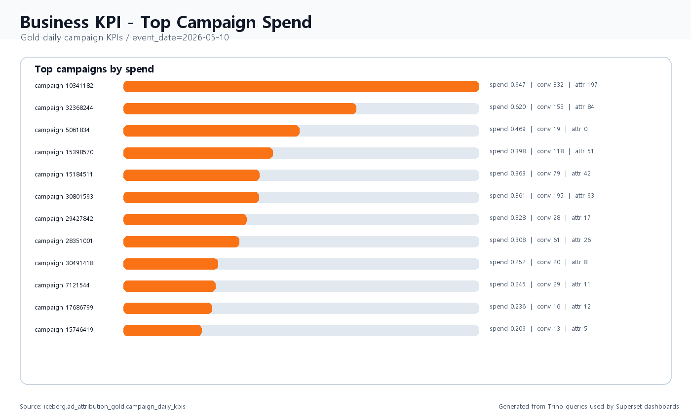
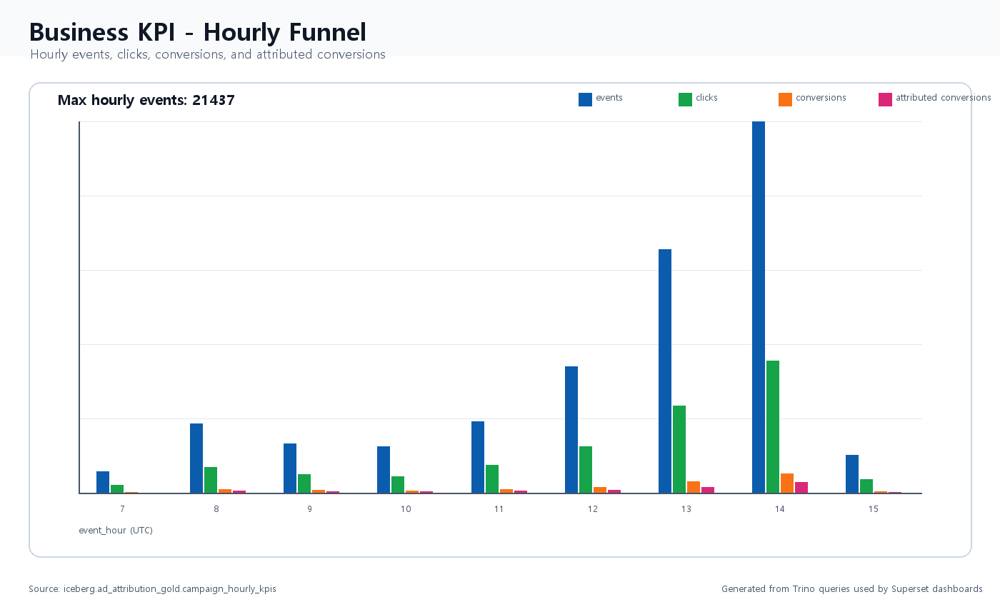
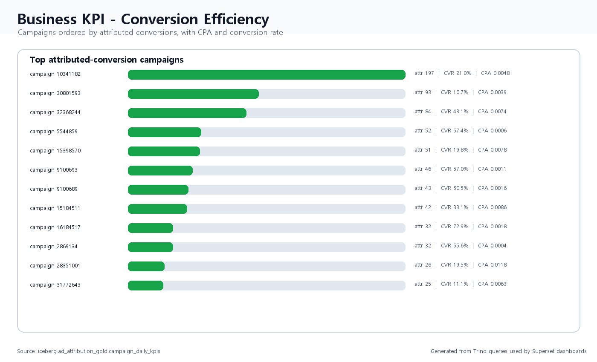
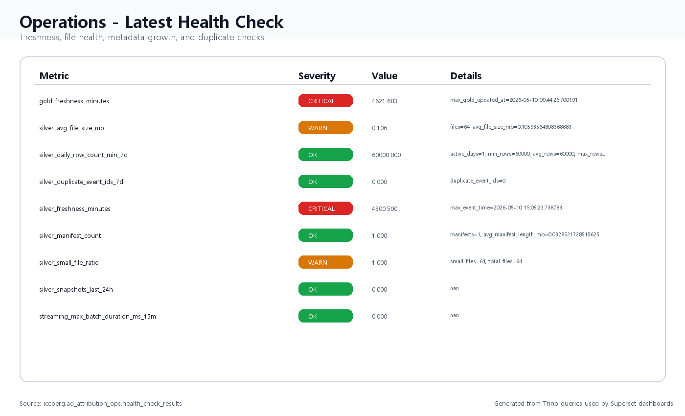
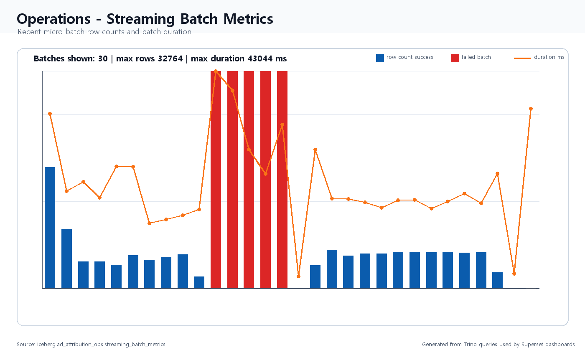

# dashboard/snapshots 디렉토리

이 디렉토리는 Superset 대시보드에 들어갈 Business KPI와 Operations 지표를 이미지로 저장한 공간입니다. `dashboard/` 아래에 두어 BI 산출물, SQL, Superset 정의 파일을 한곳에서 관리합니다.

현재 이미지는 Superset이 조회하는 것과 같은 Trino/Iceberg SQL 결과를 사용해 생성했습니다. 즉 원천 데이터는 Superset virtual dataset SQL과 동일한 Gold/Ops 테이블입니다.

## Business KPI

### Top Campaign Spend

상위 spend 캠페인을 보여줍니다. 광고 운영자가 어떤 캠페인에 비용이 집중되는지 빠르게 확인하기 위한 차트입니다.

### Hourly Funnel

시간대별 events, clicks, conversions, attributed conversions를 비교합니다. 특정 시간대에 클릭 또는 전환이 급감하는지 확인할 수 있습니다.

### Conversion Efficiency

attributed conversion이 많은 캠페인과 conversion rate, CPA를 함께 봅니다. 단순 spend가 아니라 성과 효율 관점에서 캠페인을 비교하기 위한 차트입니다.

## Operations

### Latest Health Check

Silver/Gold freshness, small file ratio, duplicate event_id, manifest/snapshot 상태를 확인합니다. 이 차트는 운영자가 5분 안에 파이프라인 상태를 판단하는 용도입니다.

### Streaming Batch Metrics

Spark Structured Streaming micro-batch별 row count와 batch duration을 보여줍니다. Kafka lag 증가와 함께 보면 Spark executor 확장 판단에 사용할 수 있습니다.

## Data Extracts

차트 생성에 사용한 CSV는 `data/` 아래에 저장했습니다.

- `daily_top_campaigns.csv`
- `hourly_kpis.csv`
- `conversion_efficiency.csv`
- `operations_health_latest.csv`
- `operations_streaming_batches.csv`

이 CSV들은 Trino CLI로 Iceberg Gold/Ops 테이블을 조회해 만든 결과입니다.
